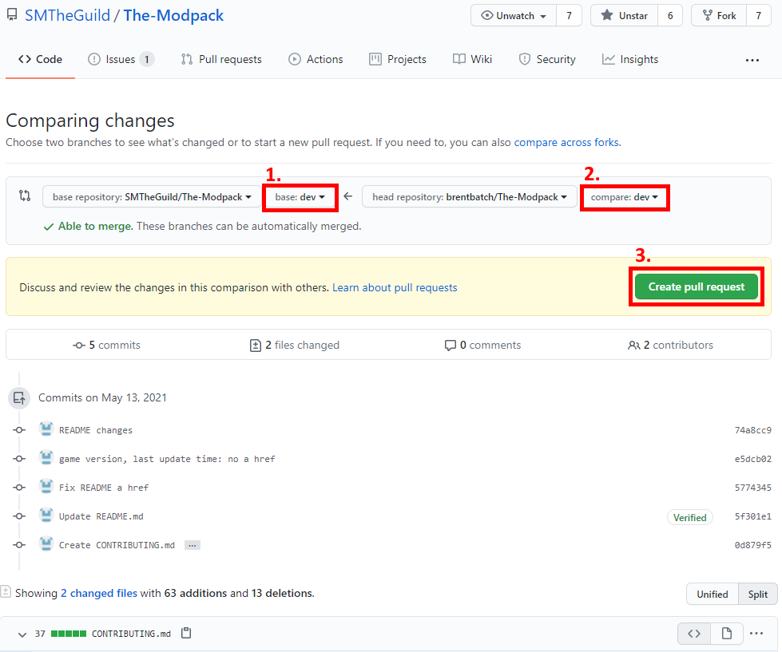

# Contribute to The Modpack

You can find more information about The Modpack [here](https://SMTheGuild.github.io/The-Modpack/).

## Index

* [Index](#Index)
* [How do I contribute](#How-do-I-contribute)
  * [Create issues](#Create-issues)
  * [Contribute code](#Contribute-code)
* [Guidelines](#Guidelines)
  * [Naming convensions](#Naming-convensions)
  * [Folder structure](#Folder-structure)
  * [Source control](#Source-control)
  * [Pull Request == feature](#Pull-Request--feature)

## How do I contribute?

### Create issues

You can create issues [here](https://github.com/SMTheGuild/The-Modpack/issues).  
*What can you do there?*
- Report bugs.
- Request fixes.
- Request features.
- Ask questions.

Before you create a new issue, please do a search in open issues to see if the issue or feature request has already been filed.  
If you find your issue already exists, make relevant comments and add your reaction.  
Use a reaction in place of a "+1" comment:  
👍 - upvote  
👎 - downvote  
If you cannot find an existing issue that describes your bug or feature, create a new issue.  

### Contribute code

If you want to add features, fix bugs, or do any other changes. you can do so!  
Even contributing to this *contributing guidelines* file is possible!

  
Click to show a <b>Contribution tutorial</b>

  
  1. Create or login to [Github](https://github.com/login).
  2. Download [Github Desktop](https://desktop.github.com/).
  3. Fork the ['The Modpack'](https://github.com/SMTheGuild/The-Modpack) repository.  
    
  4. Clone your forked repository.  
    A. Click the 'Code' button & 'Open with github desktop' button.  
        
    B. Click 'Open GitHubDesktop.exe'  
        
    C. Choose your mods folder and click 'clone'.  
      
  5. In Github Desktop, Select the 'dev' branch.  
    
  6. Create your local changes.  
    :warning: To test out your changes, copy the ``.../Mods/The-Modpack/dist/description.json`` and ``.../Mods/The-Modpack/dist/preview.jpg`` files to your ``.../Mods/The-Modpack/`` folder.
  7. Commit your changes in github desktop by providing a useful commit message, clicking 'Commit to dev' and then 'Fetch origin'/'Push origin' at the top.  
    
  8. If you are happy with your changes you can open a pull request.  
    A. Go to your forked repository page (example: https://github.com/brentbatch/The-Modpack/)  
    B. Open the tab 'Pull Requests'  
    C. Click 'new pull request'  
    D. Select the 'dev' branch for both repositories as shown below  
    E. Click 'Create pull request'  
    F. We'll take it from here! :)
      
    

## Guidelines

### Naming convensions

A Lua file should only define a **maximum** of **one class**. Classes should be named in PascalCase.  
If a Lua file defines a class, it should be named ``<ClassName>.lua``.

### Folder structure

**Folder names** inside ``Scripts/`` should be in lowercase.  
**Interactable class** files should be located in ``Scripts/interactable/``.  
**Tool class** files should be located in ``Scripts/tool/``.  
**Libraries and utility scripts** should be located in ``Scripts/libs/``.  
**Json data files** should be located in ``Scripts/data/`` and be named in underscore_case (e.g. shape_database.json).

### Source control

Before you start working on your own changes make sure to pull the latest **upstream** changes. (Changes on the SMTheGuild 'The Modpack' repository)  
You can do this by going to your forked repository in browser and clicking the 'Fetch upstream' button.  
:warning: Only applies to you if your forked repository (dev!) is ***behind*** of ``SMTheGuild:dev``!

  
GitHub screenshot</b>

### Pull Request == feature

Every pull request you do should only be about few changes. This could be a pull request adding a new feature to a certain part, or editing a language file, or some other change. But not 'some minor changes' here and there without a descriptive theme generalizing all those changes.

#### Good examples:
- "**Fixing typo's**": a pull request where **only** part description typo's are fixed.
- "**Rgb block lua performance fix**": a pull request with changes to fix rgb block performance issues.
- "**Add portal gun**": a pull request that adds the 'portal gun' part (includes *all* required changes; part.json, lua code, language descriptions, ...)

#### BAD examples:
- "**Minor fixes**": a pull request with random whitespace changes, adding comments, changing variable names, delete unused file, ...
- "**Mathblock vector support**": a pull request that adds some feature in the **orienter**

#### Exceptions:
- "**Mod X compatibility support**": a pull request with changes required to have compatibility with mod X without breaking existing functionality.